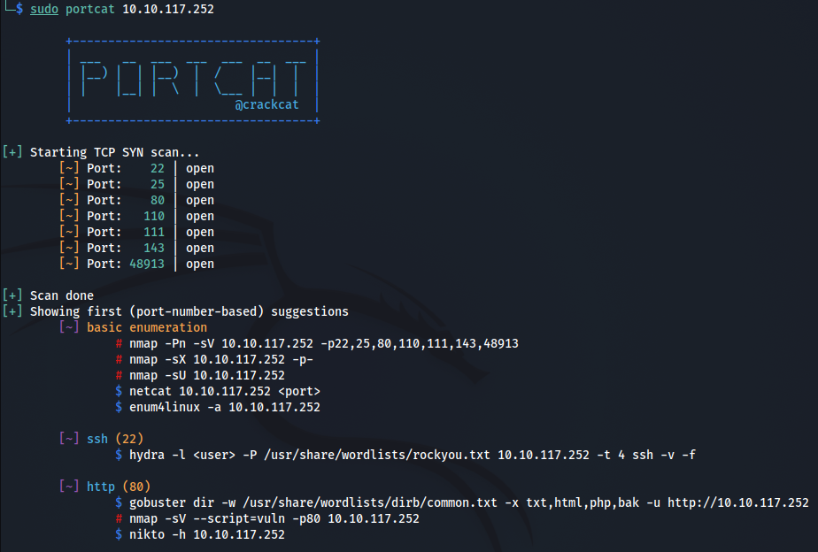

# `portcat`

### Description

Scan for open TCP ports in `C`. (Very small version of `nmap -sS` - does not supplement an `nmap` scan in every case though).

*Note*: [Issue: Missing open ports](https://github.com/Cr4ckC4t/portcat/issues/1) was fixed by adding a delay between (`SCAN_DELAY_NS`) between the tcp requests to avoid flooding the target. The delay can be decreased to make the scan faster (flooding the target at the chance of missing responses of higher ports). It can also be increased to make the scan more reliable (allowing enough time for the target to respond to every request) which comes at the cost of an increased overall scan time.

> The default code takes ~30 seconds to scan all ports with a tested response rate of 99,8% of all ports.

### Compilation

The code can be compiled with `gcc -pthread -Wall -o portcat portcat.c`.

---

This tool was mainly written to brush up my `C` socket programming and also to help during CTF's by doing a fast SYN scan and building a list of useful commands to run next.

### Example
**Usage**:
```
sudo portcat <FQHN>
```


