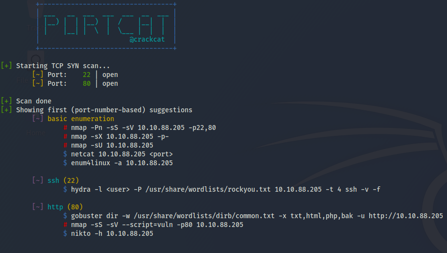

# `portcat`

### Description

Scan for open TCP ports in `C`. (Very small version of `nmap -sS` - does not supplement an `nmap` scan in every case though).

### Compilation

The code can be compiled with `gcc -pthread -Wall -o portcat portcat.c`.

---

This tool was mainly written to brush up my `C` socket programming and also to help during CTF's by doing a fast SYN scan and building a list of useful commands to run next.

### Example
**Usage**:
```
portcat <FQHN>
```


